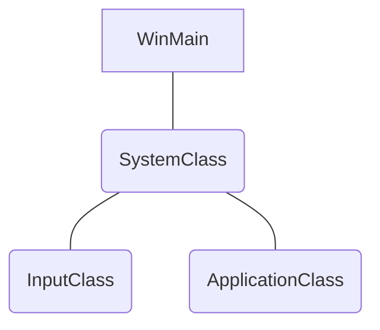

> ALL OF THIS CAME FROM RASTERTEK. HIS TUTORIALS ARE INSANE, GO CHECK IT OUT.
> https://rastertek.com/



### `WinMain.cpp`
```cpp
//  Main.cpp
int WINAPI WinMain(HINSTANCE hInstance, HINSTANCE hPrevInstance, 
				   PSTR pScmdline, int iCmdshow)
{

	SystemClass* System;
	bool result;

//  Create the system object.
	System = new SystemClass;

//  Initialize and run the system object.
	result = System->Initialize();
	if (result)
	{
		System->Run();
	}

//  Shutdown and release the system object.
	System->Shutdown();
	delete System;
	System = 0;
	
	return;
}
```

The WinMain is fairly simple. We create the system class and then initialize it. If it initializes with no problems then we call the system class Run function. The Run functions will run its own loop and do all the application code until it completes. After the Run function finishes, we then shut down the system object and do the clean up of the system object.

### `SystemClass.h`
```cpp
//  SystemClass.h
#ifndef _SYSTEMCLASS_H_
#define _SYSTEMCLASS_H_

/*
Here we define WIN32_LEAN_AND_MEAN. We do this to speed up the build process.
It reduces the size of the Win32 header files by excluding some of the less used APIs.
*/
#define WIN32_LEAN_AND_MEAN

#include <windows.h>
#include "inputclass.h"
#include "applicationclass.h"

// windows.h is included so we can call the funcstions to create/destroy windows and
// be able to use the other useful Win32 functions.

class SystemClass
{
public:
	SystemClass();
	SystemClass(const SystemClass&);
	~SystemClass();

	bool Initialize();
	void Shutdown();
	void Run();

	LRESULT CALLBACK MessageHandler(HWND, UINT, WPARAM, LPARAM);
private:
	bool Frame();
	void InitializeWindows(int&, int&);
	void ShutdownWindows();

	LPCWSTR m_applicationName;
	HINSTANCE m_hinstance;
	HWND m_hwnd;

	InputClass* m_Input;
	ApplicationClass* m_Application;
};

static LRESULT CALLBACK WndProc(HWND, UINT, WPARAM, LPARAM);

static SystemClass* ApplicationHandle = 0;

#endif
```

We see Initialize, Shutdown and Run functions that will be called in WinMain defined here. There are also some private functions that will be called inside those functions. We have a MessageHandler function which handles the windows system messages that will get sent to the application while it is running. And finaly, some private variables m_Input and m_Application which will be pointers to the two objects that will handle input and the graphics rendering.

The WndProc function and ApplicationHandle pointer are also included in this class file so we can re-direct the windows system messaging into our MessageHandler function inside the system class.

Now let's see the system class source file.

### `SystemClass.cpp`

```cpp
//  SystemClass.cpp
#include "SystemClass.h"
```

In the class constructor it is initialized the object pointers to null. This is important because if the initialization of these objects fail then the Shutdown function further on will attempt to clean up those objects. If the objects are not null, then, it assumes they're valid created objects and that they need to be cleaned up. It is a good practice and some release builds will fail if you do not do so.
Here it is created empty copy constructor and empty class destructor. In this class we don't have need of them but if not defined some compilers will generate them for you, in which case I'd rather they be empty. 
Also, notice we don't have any object clean up in the class destructor. Instead, do all objects clean up in the Shutdown function, the reason being is that the autor doesn't trust on it to be called. Certain windows functions like ExitThread() are known for not calling your class destructors resulting in memory leaks. You can of course call safer versions of these functions now but it is cafefuller when programming on windows.

```cpp
//  SystemClass.cpp
SystemClass::SystemClass()
{
	m_Input = 0;
	m_Application = 0;
}

SystemClass::SystemClass(const SystemClass& other)
{

}

SystemClass::~SystemClass()
{

}
```

##### `SystemClass::Initialize`
The following Initialize function does all the setup for the application. It first calls InitializeWindows which will create the window for our application to use. It also creates and initializes both the input and application objects that the application will use for handling user input and rendering graphics to the screen.

```cpp
//  SystemClass.cpp
bool SystemClass::Initialize()
{
	int screenWidth, screenHeight;
	bool result;

	screenWidth = 0;
	screenHeight = 0;

	InitializeWindows(screenWidth, screenHeight);
	
	m_Input = new InputClass;
	m_Input->Initialize();

	m_Application = new ApplicationClass;

	result = m_Application->Initialize(screenWidth, screenHeight, m_hwnd);
	if (!result)
	{
		return false;
	}

	return true;
}
```

##### `SystemClass::Shutdown()`
The Shutdown function does the clean up. It shuts down and releases everything associated with the application and input object. As well it also shuts down the window and cleans up the handles associated with it.

```cpp
//  SystemClass.cpp
void SystemClass::Shutdown()
{
//  Release the application class object.
	if (m_Application)
	{
		m_Application->Shutdown();
		delete m_Application;
		m_Application = 0;
	}
	
//  Release the input object.
	if (m_Input)
	{
		delete m_Input;
		m_Input = 0;
	}
	ShutdownWindows();
	
	return;
}
```

##### `SystemClass::Run()`
The Run function is where our application will loop and do all the application processing until we decide to quit. The application processing is done in the Frame function which is called each loop. This is an important concept to understand as now the rest of our application must be written whith this in mind.

```cpp
//  SystemClass.cpp
void SystemClass::Run()
{
	MSG msg;
	bool done, result;

//  Initialize the message structure.
	ZeroMemory(&msg, sizeof(MSG));


//  Loop until there is a quit message from the window or the user.
	done = false;
	while (!done)
	{
//  Handle the windows messages.
		if (PeekMessage(&msg, NULL, 0, 0, PM_REMOVE))
		{
			TranslateMessage(&msg);
			DispatchMessage(&msg);
		}
//  If windows signals to end the application then exit out.
		if (msg.message == WM_QUIT)
		{
			done = true;
		}
		else
		{
//  Otherwise do the frame processing.
			result = Frame();
			if (!result)
			{
				done = true;
			}
		}
	}

	return;
}
```

##### `SystemClass::Frame()`
The following Frame function is where all the processing for our application is done. So far it is fairly simple, we check the input object to see if the usar has pressed escape and wants to quit. If they don't want to quit then we call the application class object to do its frame processing which will render the graphics for that frame.

```cpp
//  SystemClass.cpp
bool SystemClass::Frame()
{
	bool result;

//  Check if the user pressed escape and wants to exit the application.
	if (m_Input->IsKeyDown(VK_ESCAPE))
	{
		return false;
	}

//  Do the frame processing for the application class object.
	result = m_Application->Frame();
	if (!result)
	{
		return false;
	}
	
	return true;
}
```

##### `SystemClass::MessageHandler()`
The MessageHandler function is where we direct the windows system messages into. This way we can listen to certain information that we are interested in. Currently we just read if a key is pressed or if a key is released and pass that information on the input object. All other information we will pass back to the windows default message handler.

```cpp
//  SystemClass.cpp
LRESULT CALLBACK SystemClass::MessageHandler(HWND hwnd, UINT umsg, WPARAM wparam, LPARAM lparam)
{
	switch(umsg)
	{
		case WM_KEYDOWN:
		{
			m_Input->KeyDown((unsigned int)wparam);
			return 0;
		}
		case WM_KEYUP:
		{
			m_Input->KeyUp((unsigned int)wparam);
			return 0;
		}
		default:
		{
			return DefWindowProc(hwnd, umsg, wparam, lparam);
		}
	}
}
```

##### `SystemClass::InitializeWindows()`
The InitializeWindows function is where we put the code to build the window we will use to render to. It returns screenWidth and screenHeight back to the calling function so we make use of them throughout the application. We createthe window using some default settings to initialize a plain black window with no borders. The function will make either a small window or make a full screen window depending on a global variable called FULL_SCREEN. If this is set to true then we make the screen cover the entire user's desktop window. If it is set to false, we just make a small window in the middle of the screen. It will make more sense later.

```cpp
//  SystemClass.cpp
void SystemClass::InitializeWindows(int& screenWidth, int& screenHeight)
{
	WNDCLASSEX wc;
	DEVMODE dmScreenSettings;
	int posX, posY;

//  Get an external pointer to this object.
	ApplicationHandle = this;

//  Get the instance of this application.
	m_hinstance = GetModuleHandle(NULL);

//  Give the application a name.
	m_applicationName = L"Henzoparahua dx11zSTD";

//  Setup the windows class with default settings.
	wc.style = CS_HREDRAW | CS_VREDRAW | CS_OWNDC;
	wc.lpfnWndProc = WndProc;
	wc.cbClsExtra = 0;
	wc.cbWndExtra = 0;
	wc.hInstance = m_hinstance;
	wc.hIcon = LoadIcon(NULL, IDI_WINLOGO);
	wc.hIconSm = wc.hIcon;
	wc.hCursor = LoadCursor(NULL, IDC_ARROW);
	wc.hbrBackground = (HBRUSH)GetStockObject(BLACK_BRUSH);
	wc.lpszMenuName = NULL;
	wc.lpszClassName = m_applicationName;
	wc.cbSize = sizeof(WNDCLASSEX);

//  Register the window class
	RegisterClassEx(&wc);

//  Determine the resolution of the clients desktop screen.
	screenWidth = GetSystemMetrics(SM_CXSCREEN);
	screenHeight = GetSystemMetrics(SM_CYSCREEN);

//  If full screen set the screen to maximum size of the users desktop and 32bit.
	if (FULL_SCREEN)
	{
		memset(&dmScreenSettings, 0, sizeof(dmScreenSettings));
		dmScreenSettings.dmSize = sizeof(dmScreenSettings);
		dmScreenSettings.dmPelsWidth = (unsigned long)screenWidth;
		dmScreenSettings.dmPelsHeight = (unsigned long)screenHeight; 
		dmScreenSettings.dmBitsPerPel = 32;
		dmScreenSettings.dmFields = DM_BITSPERPEL | DM_PELSWIDTH | DM_PELSHEIGHT;

//  Change the display settings to full screen.
		ChangeDisplaySettings(&dmScreenSettings, CDS_FULLSCREEN);

//  Set the position of the window to the top left corner.
		posX = posY = 0;
	}
	else
	{
//  If windowed then set it to this resolution.
		screenWidth = 1278;
		screenHeight = 720;

//  Place the window in the middle of the screen.
		posX = (GetSystemMetrics(SM_CXSCREEN) - screenWidth) / 2;
		posY = (GetSystemMetrics(SM_CYSCREEN) - screenHeight) / 2;
	}
	
//  Create the window with the screen settings and get the handle to it.
	m_hwnd = CreateWindowEx(WS_EX_APPWINDOW, m_applicationName, m_applicationName,
		WS_CLIPSIBLINGS | WS_CLIPCHILDREN | WS_POPUP,
		posX, posY, screenWidth, screenHeight, NULL, NULL, m_hinstance, NULL);

//  Bring the window up on the screen and set it as main focus.
	ShowWindow(m_hwnd, SW_SHOW);
	SetForegroundWindow(m_hwnd);
	SetFocus(m_hwnd);

//  Hide the mouse cursor.
	ShowCursor(false);

	return;
}
```

##### `SystemClass::ShutdownWindows()`
ShutdownWindows does just that. It returns the screen settings back to normal and releases the window and te handles associated with it.

```cpp
//  SystemClass.cpp
void SystemClass::ShutdownWindows()
{
//  Show the mouse cursor.
	ShowCursor(true);

//  Fix the display settings if leaving full screen mode.

	if (FULL_SCREEN)
	{
		ChangeDisplaySettings(NULL, 0);
	}

//  Remove the window.
	DestroyWindow(m_hwnd);
	m_hwnd = NULL;

//  Remove the application instance.
	UnregisterClass(m_applicationName, m_hinstance);
	m_hinstance = NULL;

//  Release the pointer to this class.
	ApplicationHandle = NULL;

	return;
}
```

##### `WndProc()`
The WndProc function is where windows sends its messages to. You'll notice we tell windows the name of it when we initialize the window class with `wc.lpfnWndProc = WndProc` in the InitializeWindows function above. I included it in this class file since we tie it directly into the system class by having it send all the messages to the MessageHandler function defined inside SystemClass. This allows us to hook the messaging functionality straight into our class and keep the code clean.

```cpp
// SystemClass.cpp
LRESULT CALLBACK WndProc(HWND hwnd, UINT umessage, WPARAM wparam, LPARAM lparam)
{
	switch (umessage)
	{
//  Check if the window is being destroyed
		case WM_DESTROY:
		{
			PostQuitMessage(0);
			return 0;
		}
//  Check if the window is being closed.
		case WM_CLOSE:
		{
			PostQuitMessage(0);
			return 0;
		}
		default:
		{
			return ApplicationHandle->MessageHandler(hwnd, umessage, wparam, lparam);
		}
	}
}
```
### `InputClass.h`

To keep it simple, we used the windows input for the time being untill we do a tutorial on DirectInput (which is far superior). The input class handles the user input from the keyboard. This class is given input from the [[#`SystemClass MessageHandler()`]] function. The input object will store the state of each key in a keyboard array. When queried it will tell the calling functions if a certain key is pressed.

```cpp
// InputClass.h

#ifndef _INPUTCLASS_H_
#define _INPUTCLASS_H_

class InputClass
{
public:
	InputClass();
	InputClass(const InputClass&);
	~InputClass();

	void Initialize();

	void KeyDown(unsigned int);
	void KeyUp(unsigned int);

	bool isKeyDown(unsigned int);

private:
	bool m_keys[256];
};

#endif
```

### `InputClass.cpp`
```cpp
// InputClass.cpp
#include "inputclass.h"

InputClass::InputClass()
{

}

InputClass::InputClass(const InputClass& other)
{

}

InputClass::~InputClass()
{

}


void InputClass::Initialize()
{
	int i;

//  Initialize all the keys for being released and not pressed.
	for (i = 0; i < 256; i++)
	{
		m_keys[i] = false;
	}
	return;
}

void InputClass::KeyDown(unsigned int input)
{
//  If a key is pressed then save that state in the key array.
	m_keys[input] = true;
	return;
}

void InputClass::KeyUp(unsigned int input)
{
//  If a key is released then clear that state in the key array.
	m_keys[input] = false;
	return;
}

bool InputClass::IsKeyDown(unsigned int key)
{
//  Return what state the key is in (pressed/not pressed).
	return m_keys[key];
}
```
### `ApplicationClass.h`

The application class is the other object that is created by the system class. All the graphics functionality in this application will be encapsulated in this class. I will also use the header in this filee for all graphics related global settings that we may want to change such as full screen or windowed mode.
```cpp
// ApplicationClass.h

#ifndef _APPLICATIONCLASS_H_
#define _APPLICATIONCLASS_H_

#include <windows.h>

const bool FULL_SCREEN = false;
const bool VSYNC_ENABLED = true;
const float SCREEN_DEPTH = 1000.0f;
const float SCREEN_NEAR = 0.3f;

class ApplicationClass
{
public:
	ApplicationClass();
	ApplicationClass(const ApplicationClass&);
	~ApplicationClass();

	bool Initialize(int, int, HWND);
	void Shutdown();
	bool Frame();

private:
	bool Render();
};

#endif
```

### `ApplicationClass.cpp`
```cpp
// ApplicationClass.cpp

#include "applicationclass.h"

ApplicationClass::ApplicationClass()
{

}

ApplicationClass::ApplicationClass(const ApplicationClass& other)
{

}

ApplicationClass::~ApplicationClass()
{

}

bool ApplicationClass::Initialize(int screenWidth, int screenHeight, HWND hwnd)
{
	return true;
}

void ApplicationClass::Shutdown()
{
	return;
}

bool ApplicationClass::Frame()
{
	return true;
}

bool ApplicationClass::Render()
{
	return true;
}
```
